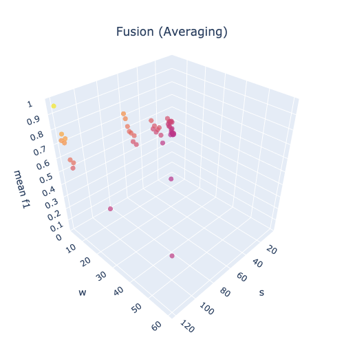
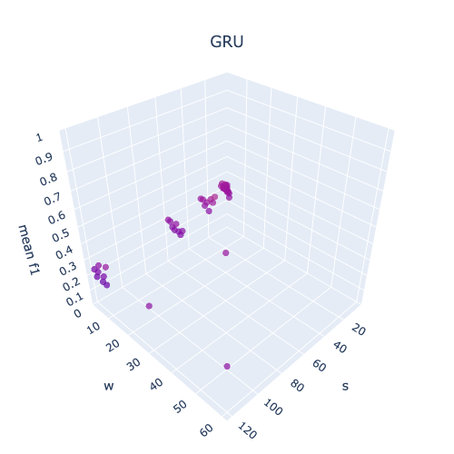
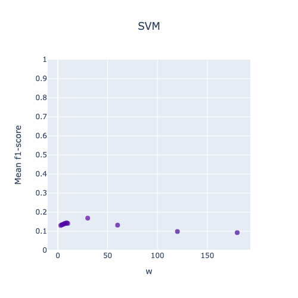
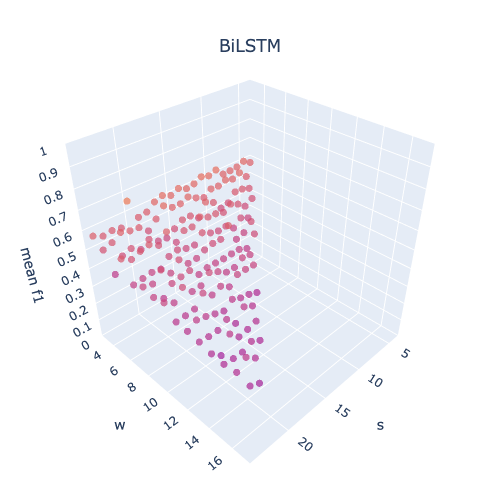
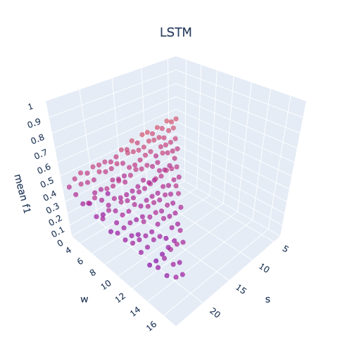
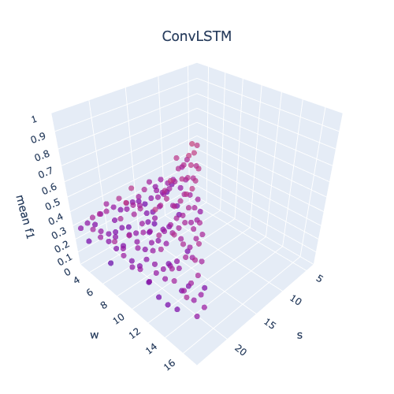

# Uncertainty Quantification to Enhance Probabilistic Fusion Based User Identification Using Smartphones

[Rouhollah Ahmadian](https://www.linkedin.com/in/ruhollah-ahmadian)1 ,
[Mehdi Ghatee](https://aut.ac.ir/cv/2174/MEHDI-GHATEE?slc_lang=en&&cv=2174&mod=scv)1,
[Johan Wahlström](https://emps.exeter.ac.uk/computer-science/staff/cw840)2 
[Hadi Zare](https://fnst.ut.ac.ir/en/~h.zare)3 
1Amirkabir University of Technology, 2University of Exeter, 3University of Tehran

<!-- ABOUT THE PROJECT -->

## About The Project

User identification is the process of identifying a person within a group of people. This project compares several
machine learning models for user identification based on IMU signals such as accelerometer and gyroscope.

## Files & Directories

1. BaselineModels.ipynb: It includes the implementation of baseline models for comparison with the proposed model.
2. BaselineFusion.ipynb: It contains the implementation of models using fusion functions, averaging, and majority
   voting.
3. UserIdentificationAnalysis.ipynb: It includes the implementation of the proposed model, which is based on uncertainty
   quantification and accompanied by various analyses such as SOTA, convergence analysis (D'Alembert's Ratio Test), and
   similarity visualization.
4. ProposedModel.ipynb : It encompasses the absolute implementation of the proposed model.

## Evaluation Methodology

Given the nature of our data being signal-oriented, the technique of $h$-block cross-validation is employed for model
selection and hyperparameter tuning. The below figure shows the evaluation methodogy. Also, each class data is divided
separately and then concatenated. So all three parts have all classes. Therefore, the reported results are the average
of several expeiments.

## Datasets

#### UIFW [[1]](#1)

Theis dataset is a collection of accelerometer data obtained from an Android smartphone positioned in the chest pocket
of 22 participants who were walking in natural environments \cite{casale2012personalization}. This dataset has been
specifically curated for activity recognition research, presenting opportunities to tackle the identification and
authentication of individuals based on their motion patterns.

#### CLD [[2]](#2)

This dataset encompasses localization data recorded from a group of 5 individuals wearing tags on their left ankle,
right ankle, belt, and chest \cite{kaluvza2010agent}. It provides valuable information such as three-dimensional tag
coordinates (x, y, z), and various activities performed, including walking, falling, lying down, sitting, and standing
up.

#### HOP [[3]](#3)

With a focus on 12 healthy older adults aged between 66 and 86, this dataset captures motion data using a wearable
sensor placed at the sternum level \cite{torres2013sensor}.
The dataset is sparse and noisy due to the use of a passive sensor. The collected data includes acceleration readings in
three axes and covers activities such as sitting on a bed, sitting on a chair, lying on a bed, and ambulating (standing
and walking). The data was acquired in clinical room settings with the aid of RFID reader antennas.

#### Dataset \#2 (DB2) [[4]](#4)

Gait data from 20 subjects segmented with a sliding window approach (window length: 128, no overlap). Dataset split into
70\% training and 30\% testing sets.

#### UCI-HAR (HAR): [[5]](#5)

Accelerometer and gyroscope data from 30 volunteers (19-48 years) preprocessed with low-pass filters. Segmented into
fixed-width sliding windows (2.56s, 50\% overlap). Dataset divided into 70\% training and 30\% testing sets.

## Hyperparameters

It is important to optimize parameters to have a fair comparison between the proposed model and baseline models.
We use grid search to find the best model configurations.
The hyperparameters of this project:

* `w`: it refers to the window length used in segmentation.
* `r`: it is the window overlap. As it take a lot of computing though, `r` is fixed at 75\% for all experiments.
* `s`: it only relates to recurrent models. It shows the input sequence length, while `w` is the hidden unit length for
  each subsequence.

#### Hyperparameters Tuning based on CLD Dataset

|                                                                                            |                                                                                          |                                                                                              |
|:------------------------------------------------------------------------------------------:|:----------------------------------------------------------------------------------------:|:--------------------------------------------------------------------------------------------:|
|  |      |             
|              |           |           
|              |            |  
|              |  |                |

#### Hyperparameters Tuning based on HOP Dataset

|                                                                                                |                                                                                                  |                                                                                                  |
|:----------------------------------------------------------------------------------------------:|:------------------------------------------------------------------------------------------------:|:------------------------------------------------------------------------------------------------:|
|  |          |             
|              |               |           
|              |                |  
|              |      |                |

#### Hyperparameters Tuning based on UIFW Dataset

|                                                                                                            |                                                                                                              |                                                                                                  |
|:----------------------------------------------------------------------------------------------------------:|:------------------------------------------------------------------------------------------------------------:|:------------------------------------------------------------------------------------------------:|
|  |          |             
|              |               |           
|              |                |  
|              |      |              |

## Comparison of the proposed model with the baseline models in terms of F1-Score

| Dataset |          Model           |   `w`    |   `s`    |      F1-Score      |
|:-------:|:------------------------:|:--------:|:--------:|:------------------:|
|   CLD   |           KNN            | 00:00:03 |    -     |   25.50 (± 0.02)   |
|   CLD   |           MLP            | 00:00:04 |    -     |   33.45 (± 0.12)   |
|   CLD   |            RF            | 00:00:08 |    -     |   07.62 (± 0.01)   |
|   CLD   |            LR            | 00:02:00 |    -     |   30.43 (± 0.14)   |
|   CLD   |           SVM            | 00:02:00 |    -     |   31.53 (± 0.17)   |
|   CLD   |           CNN            | 00:00:03 |    -     |   56.71 (± 0.10)   |
|   CLD   |           GRU            | 00:00:10 | 00:00:30 |   39.65 (± 0.06)   |
|   CLD   |           LSTM           | 00:00:03 | 00:00:09 |   37.25 (± 0.04)   |
|   CLD   |          BiLSTM          | 00:00:07 | 00:01:00 |   52.22 (± 0.12)   |
|   CLD   |         ConvLSTM         | 00:00:03 | 00:04:00 |   36.33 (± 0.03)   |
|   CLD   | Fusion (Majority Voting) | 00:00:03 | 00:02:00 |   95.30 (± 0.05)   |
|   CLD   |    Fusion (Averaging)    | 00:00:03 | 00:02:00 | **95.49 (± 0.04)** |
|   CLD   |      **Our Fusion**      | 00:00:03 | 00:02:00 | **98.67 (± 0.03)** |
|   HOP   |           KNN            | 00:00:04 |    -     |   31.47 (± 0.06)   |
|   HOP   |           MLP            | 00:00:04 |    -     |   30.38 (± 0.06)   |
|   HOP   |            RF            | 00:00:03 |    -     |   31.60 (± 0.06)   |
|   HOP   |            LR            | 00:00:30 |    -     |   19.63 (± 0.04)   |
|   HOP   |           SVM            | 00:00:30 |    -     |   16.86 (± 0.04)   |
|   HOP   |           CNN            | 00:00:06 |    -     |   37.09 (± 0.07)   |
|   HOP   |           GRU            | 00:00:06 | 00:00:10 |   36.84 (± 0.07)   |
|   HOP   |           LSTM           | 00:00:03 | 00:00:08 |   36.45 (± 0.06)   |
|   HOP   |          BiLSTM          | 00:00:06 | 00:00:10 |   36.91 (± 0.06)   |
|   HOP   |         ConvLSTM         | 00:00:03 | 00:00:09 |   32.06 (± 0.06)   |
|   HOP   | Fusion (Majority Voting) | 00:00:08 | 00:03:00 |   62.40 (± 0.08)   |
|   HOP   |    Fusion (Averaging)    | 00:00:08 | 00:03:00 | **64.63 (± 0.08)** |
|   HOP   |      **Our Fusion**      | 00:00:08 | 00:03:00 | **65.11 (± 0.08)** |
|  UIFW   |           KNN            | 00:00:03 |    -     |   33.92 (± 0.03)   |
|  UIFW   |           MLP            | 00:00:03 |    -     |   40.76 (± 0.05)   |
|  UIFW   |            RF            | 00:00:03 |    -     |   12.43 (± 0.02)   |
|  UIFW   |            LR            | 00:00:08 |    -     |   26.66 (± 0.04)   |
|  UIFW   |           SVM            | 00:00:18 |    -     |   22.52 (± 0.04)   |
|  UIFW   |           CNN            | 00:00:03 |    -     |   56.75 (± 0.05)   |
|  UIFW   |           GRU            | 00:00:03 | 00:00:06 |   54.56 (± 0.07)   |
|  UIFW   |           LSTM           | 00:00:03 | 00:00:06 |   56.10 (± 0.07)   |
|  UIFW   |          BiLSTM          | 00:00:03 | 00:00:20 |   66.56 (± 0.06)   |
|  UIFW   |         ConvLSTM         | 00:00:03 | 00:00:05 |   48.18 (± 0.08)   |
|  UIFW   | Fusion (Majority Voting) | 00:00:03 | 00:00:22 |   85.57 (± 0.08)   |
|  UIFW   |    Fusion (Averaging)    | 00:00:03 | 00:00:22 | **85.74 (± 0.09)** |
|  UIFW   |      **Our Fusion**      | 00:00:03 | 00:00:22 | **88.10 (± 0.09)** |

## Benchmark

A comparison was made between this study and previous works [[4]](#4) and [[5]](#5) using the DB2 and HAR datasets,
which were also used in those studies.
To ensure a fair evaluation, the same dataset configurations were followed as in the prior work.
Both datasets were pre-segmented into standardized train/test splits, and 20% of the training data was set aside for
validation.
The following hyperparameters were used: window size (`w`) of 32 seconds, receptive field size (`r`) of 24 seconds,
stride (`s`) of 128 seconds, learning rate (`lr`) of 0.0001, batch size of 32, 50 epochs, and a maximum number of
iterations (`M`) set to 200.

| Dataset |      Ref.      |  MSE   | F1-Score  |  Recall   | Precision | Accuracy  |
|:-------:|:--------------:|:------:|:---------:|:---------:|:---------:|:---------:|
|   DB2   |   [[4]](#4)    |   -    |     -     |     -     |     -     |   97.33   |
|   DB2   | **Our Fusion** | 0.0012 |   97.23   |   96.98   |   98.89   | **98.62** |
|   HAR   |   [[5]](#5)    |   -    |   91.18   |   91.27   |     -     |   91.31   |
|   HAR   | **Our Fusion** | 0.0078 | **99.26** | **99.27** |   99.31   | **99.29** |

## References

<a id="1">[1]</a>
https://archive.ics.uci.edu/ml/datasets/User+Identification+From+Walking+Activity

<a id="1">[2]</a>
https://archive.ics.uci.edu/ml/datasets/Localization+Data+for+Person+Activity

<a id="1">[3]</a>
https://archive.ics.uci.edu/ml/datasets/Activity+recognition+with+healthy+older+people+using+a+batteryless+wearable+sensor

<a id="1">[4]</a>
Zou, Qin, et al. "Deep learning-based gait recognition using smartphones in the wild." IEEE Transactions on Information
Forensics and Security 15 (2020): 3197-3212.

<a id="1">[5]</a>
Luo, Fei, et al. "Activity-based person identification using multimodal wearable sensor data." IEEE Internet of Things
Journal 10.2 (2022): 1711-1723.